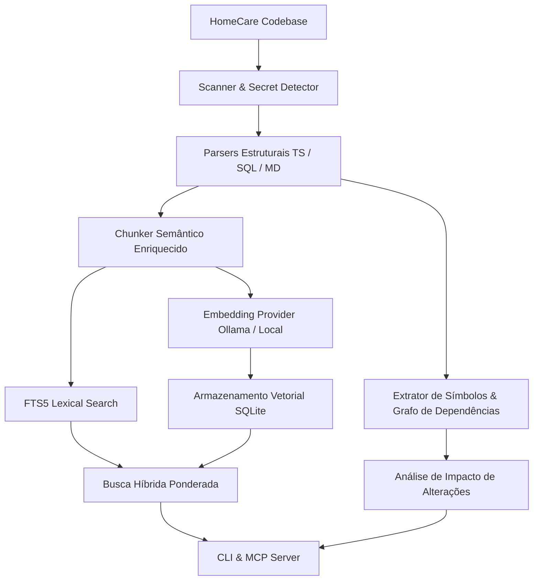

# Inteligência de Código Local (Code Index)

Este documento descreve a arquitetura, estrutura de dados e operações do **HomeCare Code Index**, a ferramenta de inteligência de código e busca semântica local do projeto HomeCare.

---

## 🧭 Visão Geral

O sistema permite consultas em linguagem natural e navegação de símbolos sobre o código TypeScript, TSX, SQL (PostgreSQL / Supabase) e documentação técnica.

---

## 🗄️ Schema do Banco SQLite (`.homecare-index/index.db`)

1. **`repositories`**: Cadastro de repositórios locais.
2. **`files`**: Metadados de arquivos, linguagem, hashes SHA256 e timestamps.
3. **`symbols`**: Funções, componentes, hooks, interfaces, types, tabelas, RPCs, policies RLS, triggers e seções de documentação.
4. **`chunks`**: Blocos contextuais enriquecidos com metadados para busca.
5. **`chunks_fts`**: Tabela virtual FTS5 para busca lexical instantânea.
6. **`dependencies`**: Grafo direcionado de dependências (`IMPORTS`, `CALLS`, `READS_TABLE`, `USES_RPC`, `REFERENCES`, `TESTS`).
7. **`index_runs`**: Histórico detalhado de execuções de indexação incremental.

---

## ⌨️ Referência de Comandos da CLI

| Comando | Descrição | Exemplo |
| :--- | :--- | :--- |
| `init` | Inicializa o banco SQLite e pastas de log | `python -m tools.code_index init` |
| `index` | Executa indexação incremental | `python -m tools.code_index index [--force]` |
| `status` | Exibe estatísticas de arquivos, símbolos e vetores | `python -m tools.code_index status` |
| `search` | Busca híbrida (semântica + textual + filtros) | `python -m tools.code_index search "vínculo médico"` |
| `symbol` | Detalhes e relacionamentos de um símbolo | `python -m tools.code_index symbol can_access_patient` |
| `deps` | Dependências externas que o símbolo consome | `python -m tools.code_index deps authorizePatientAccess` |
| `refs` | Símbolos e arquivos que consomem o alvo | `python -m tools.code_index refs can_access_patient` |
| `affected` | Análise de impacto direto e indireto | `python -m tools.code_index affected can_access_patient` |

---

## 🔒 Segurança e Privacidade

- **100% Local**: Nenhum código ou metadado é enviado para serviços externos ou APIs na nuvem.
- **Proteção contra Vazamento de Segredos**: Arquivos como `.env`, `.env.*`, `*.pem`, `*.key` e padrões de chaves/tokens privados são descartados automaticamente pelo `SecretDetector` antes de qualquer processamento.
