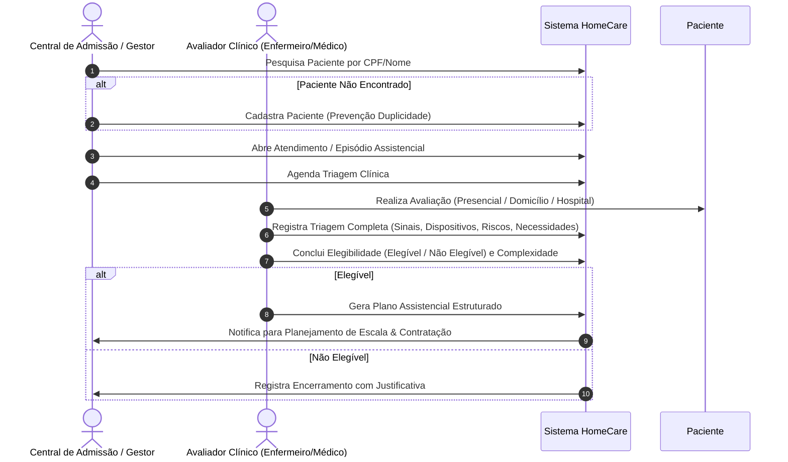
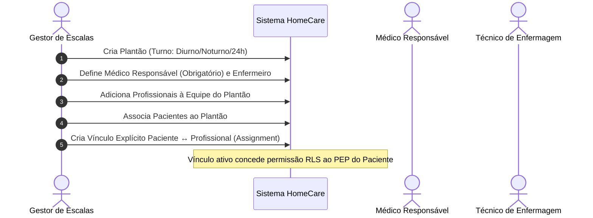
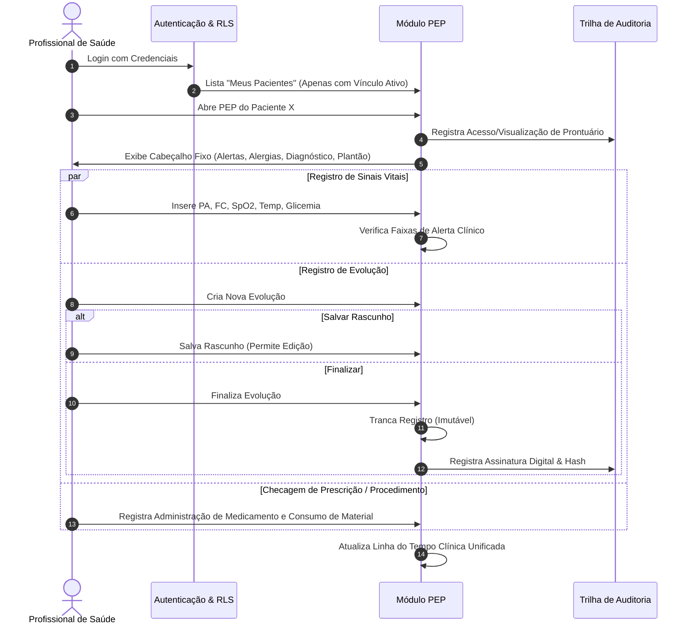

# Fluxos Operacionais & Clínicos — HomeCare

## 1. Fluxo de Admissão e Elegibilidade

```mermaid
sequenceDiagram
    autonumber
    actor C as Central de Admissão / Gestor
    actor E as Avaliador Clínico (Enfermeiro/Médico)
    participant S as Sistema HomeCare
    participant P as Paciente

    C->>S: Pesquisa Paciente por CPF/Nome
    alt Paciente Não Encontrado
        C->>S: Cadastra Paciente (Prevenção Duplicidade)
    end
    C->>S: Abre Atendimento / Episódio Assistencial
    C->>S: Agenda Triagem Clínica
    E->>P: Realiza Avaliação (Presencial / Domicílio / Hospital)
    E->>S: Registra Triagem Completa (Sinais, Dispositivos, Riscos, Necessidades)
    E->>S: Conclui Elegibilidade (Elegível / Não Elegível) e Complexidade
    alt Elegível
        E->>S: Gera Plano Assistencial Estruturado
        S->>C: Notifica para Planejamento de Escala & Contratação
    else Não Elegível
        S->>C: Registra Encerramento com Justificativa
    end
```

---

## 2. Fluxo Operacional de Escalas e Vínculo

```mermaid
sequenceDiagram
    autonumber
    actor G as Gestor de Escalas
    participant S as Sistema HomeCare
    actor M as Médico Responsável
    actor T as Técnico de Enfermagem

    G->>S: Cria Plantão (Turno: Diurno/Noturno/24h)
    G->>S: Define Médico Responsável (Obrigatório) e Enfermeiro
    G->>S: Adiciona Profissionais à Equipe do Plantão
    G->>S: Associa Pacientes ao Plantão
    G->>S: Cria Vínculo Explícito Paciente ↔ Profissional (Assignment)
    Note over S: Vínculo ativo concede permissão RLS ao PEP do Paciente
```

---

## 3. Fluxo de Atendimento no PEP Beira-Leito

```mermaid
sequenceDiagram
    autonumber
    actor Prof as Profissional de Saúde
    participant Auth as Autenticação & RLS
    participant PEP as Módulo PEP
    participant Audit as Trilha de Auditoria

    Prof->>Auth: Login com Credenciais
    Auth->>PEP: Lista "Meus Pacientes" (Apenas com Vínculo Ativo)
    Prof->>PEP: Abre PEP do Paciente X
    PEP->>Audit: Registra Acesso/Visualização de Prontuário
    PEP->>Prof: Exibe Cabeçalho Fixo (Alertas, Alergias, Diagnóstico, Plantão)
    
    par Registro de Sinais Vitais
        Prof->>PEP: Insere PA, FC, SpO2, Temp, Glicemia
        PEP->>PEP: Verifica Faixas de Alerta Clínico
    and Registro de Evolução
        Prof->>PEP: Cria Nova Evolução
        alt Salvar Rascunho
            Prof->>PEP: Salva Rascunho (Permite Edição)
        else Finalizar
            Prof->>PEP: Finaliza Evolução
            PEP->>PEP: Tranca Registro (Imutável)
            PEP->>Audit: Registra Assinatura Digital & Hash
        end
    and Checagem de Prescrição / Procedimento
        Prof->>PEP: Registra Administração de Medicamento e Consumo de Material
    end
    PEP->>PEP: Atualiza Linha do Tempo Clínica Unificada
```

