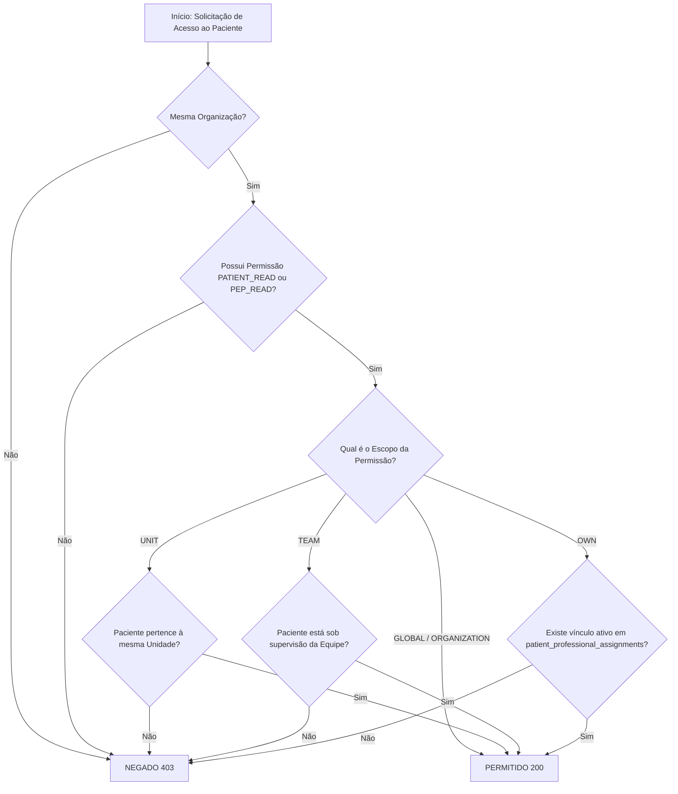

# Matriz Definitiva de Autorização & Escopos — HomeCare

## 1. Matriz de Perfis $\times$ Permissões $\times$ Escopos

| Papel (Role) | Escopo Padrão | Pacientes Visíveis | Visualização PEP | Evolução Clínica | Prescrição Médica | Gestão de Escalas | Auditoria & Logs |
| :--- | :---: | :---: | :---: | :---: | :---: | :---: | :---: |
| **SUPER_ADMIN** | `GLOBAL` | Todos | Todas as Orgs | ❌ (Sem CRM/COREN) | ❌ | Total | Leitura Geral |
| **ADMIN** | `ORGANIZATION` | Todos da Org | Conforme Permissão | ❌ | ❌ | Total | Total na Org |
| **GESTOR_UNIDADE** | `UNIT` | Unidade | Supervisão | ❌ | ❌ | Total na Unidade | Unidade |
| **MEDICO** | `OWN` | Vinculados | Permitido | Permitido | **Permitido** | Leitura da Escala | Própria |
| **ENFERMEIRO_SUPERVISOR** | `TEAM` / `UNIT` | Equipe/Unidade | Permitido | Permitido | ❌ | Supervisão | Equipe |
| **ENFERMEIRO_ASSISTENCIAL** | `OWN` | Vinculados | Permitido | Permitido | ❌ | Própria | Própria |
| **TECNICO_ENFERMAGEM** | `OWN` | Vinculados | Execução | Permitido | ❌ | Própria | Própria |
| **FISIOTERAPEUTA** | `OWN` | Vinculados | Permitido | Permitido | ❌ | Própria | Própria |
| **NUTRICIONISTA / FONOAUDIOLOGO**| `OWN` | Vinculados | Permitido | Permitido | ❌ | Própria | Própria |
| **ATENDIMENTO / ADMISSAO** | `UNIT` | Unidade | Dados Cadastrais | ❌ | ❌ | Leitura | ❌ |
| **FATURAMENTO** | `UNIT` / `ORG` | Necessários | Mínimo Necessário | ❌ | ❌ | ❌ | ❌ |
| **AUDITOR_CLINICO** | `ORGANIZATION` | Todos da Org | Leitura | ❌ | ❌ | Leitura | Leitura Total |
| **FAMILIAR / CUIDADOR_LEIGO** | `OWN` | Próprio Paciente | Portal do Familiar | ❌ | ❌ | Visualizar Plantonista | ❌ |

---

## 2. Regra de Resolução de Acesso ao Paciente (`can_access_patient`)

