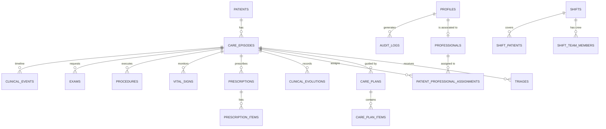

# Modelo de Dados — HomeCare

## 1. Diagrama Entidade-Relacionamento Conceitual

---

## 2. Dicionário de Tabelas Principais

### Núcleo de Usuários & Perfis
- `profiles` (`id`, `email`, `role`, `full_name`, `avatar_url`, `is_active`, `created_at`, `updated_at`)
  - Roles: `ADMIN`, `GESTOR_ESCALA`, `MEDICO`, `ENFERMEIRO`, `TECNICO_ENFERMAGEM`, `FISIOTERAPEUTA`, `NUTRICIONISTA`, `FONOAUDIOLOGO`, `PSICOLOGO`, `TERAPEUTA_OCUPACIONAL`, `FAMILIAR`.
- `professionals` (`id`, `profile_id`, `full_name`, `cpf`, `council_type`, `council_number`, `council_uf`, `profession`, `specialty`, `phone`, `status`)

### Núcleo de Pacientes & Convênios
- `insurers` (`id`, `name`, `cnpj`, `ans_code`, `status`)
- `patients` (`id`, `full_name`, `social_name`, `cpf`, `rg`, `birth_date`, `father_name`, `mother_name`, `gender`, `marital_status`, `nationality`, `race_color`, `naturalness`, `address_street`, `address_number`, `address_complement`, `address_neighborhood`, `address_city`, `address_state`, `address_zip`, `lat`, `lng`, `allergies`, `status`)

### Admissão, Triagem & Planejamento
- `care_episodes` (`id`, `patient_id`, `admission_date`, `discharge_date`, `care_type`, `insurer_id`, `doctor_in_charge_id`, `nurse_in_charge_id`, `status`)
- `triages` (`id`, `episode_id`, `patient_id`, `evaluator_id`, `evaluation_date`, `location`, `modality`, `main_diagnosis`, `cid_10`, `secondary_diagnoses`, `general_state`, `consciousness_level`, `mobility`, `feeding`, `breathing`, `eliminations`, `skin_condition`, `devices`, `risks`, `care_needs`, `eligibility`, `complexity_level`, `conclusion`, `status`)
- `care_plans` (`id`, `episode_id`, `patient_id`, `triage_id`, `version`, `start_date`, `end_date`, `status`, `created_by_id`)
- `care_plan_items` (`id`, `care_plan_id`, `category`, `profession_type`, `frequency`, `procedure_description`, `goals`)

### Plantões, Escalas & Vínculos
- `shifts` (`id`, `start_time`, `end_time`, `shift_type`, `doctor_in_charge_id`, `nurse_in_charge_id`, `status`, `notes`)
- `shift_team_members` (`id`, `shift_id`, `professional_id`, `role`, `status`)
- `shift_patients` (`id`, `shift_id`, `patient_id`, `episode_id`)
- `patient_professional_assignments` (`id`, `episode_id`, `patient_id`, `professional_id`, `role`, `start_date`, `end_date`, `is_active`)

### Prontuário Eletrônico do Paciente (PEP)
- `clinical_evolutions` (`id`, `episode_id`, `patient_id`, `professional_id`, `shift_id`, `evolution_type`, `content`, `status` [RASCUNHO, FINALIZADO], `finalized_at`, `created_at`)
- `prescriptions` (`id`, `episode_id`, `patient_id`, `doctor_id`, `start_date`, `end_date`, `status`)
- `prescription_items` (`id`, `prescription_id`, `medication_name`, `dosage`, `unit`, `route`, `frequency`, `schedule_times`, `duration_days`, `instructions`)
- `vital_signs` (`id`, `episode_id`, `patient_id`, `professional_id`, `measured_at`, `systolic_bp`, `diastolic_bp`, `heart_rate`, `respiratory_rate`, `oxygen_saturation`, `temperature`, `blood_glucose`, `weight_kg`, `pain_score`, `alerts`)
- `procedures` (`id`, `episode_id`, `patient_id`, `professional_id`, `procedure_name`, `executed_at`, `quantity`, `notes`, `materials_used`)
- `exams` (`id`, `episode_id`, `patient_id`, `requester_id`, `exam_name`, `requested_at`, `status`, `result_summary`, `result_attachment_url`)
- `clinical_events` (`id`, `episode_id`, `patient_id`, `event_type`, `event_title`, `event_timestamp`, `reference_id`, `reference_table`, `author_name`)

### Trilha de Auditoria Universal
- `audit_logs` (`id`, `user_id`, `action`, `entity_table`, `record_id`, `previous_state`, `new_state`, `client_context`, `created_at`)

